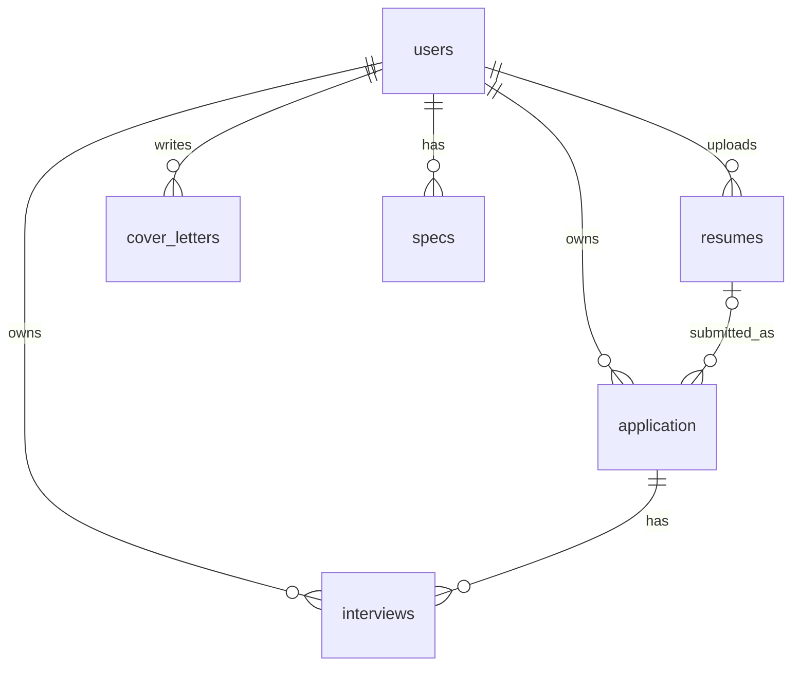

# JobTracker

취업 준비 과정에서 흩어지기 쉬운 **지원 현황 · 이력서 · 자기소개서 · 면접 · 스펙**을 한 곳에서 관리하는 웹 서비스입니다.
마감일 기준 D-Day 대시보드로 놓치기 쉬운 일정을 한눈에 확인할 수 있습니다.

## 목차

- [주요 기능](#주요-기능)
- [기술 스택](#기술-스택)
- [화면 및 주소](#화면-및-주소)
- [데이터 모델](#데이터-모델)
- [보안 및 데이터 보호](#보안-및-데이터-보호)
- [프로젝트 구조](#프로젝트-구조)
- [실행 방법](#실행-방법)

## 주요 기능

### 홈 대시보드
- 마감 현황 요약: 마감 지남(Overdue) / D-3 / D-7 / D-14 건수
- 임박한 지원 현황, 다가오는 면접 일정 목록
- 저장된 이력서 · 자격증/스펙 · 자기소개서 개수

### 지원 현황 관리
- 회사명, 포지션, 지원일, 마감일, 진행 상태, 제출 이력서 연결
- 진행 상태: 지원 완료(`APPLIED`) / 면접(`INTERVIEW`) / 합격(`OFFER`) / 불합격(`REJECTED`)
- 마감일 기준 D-Day 라벨 표시 (`D-n`, `D-Day`, `Overdue n`)
- 키워드 검색, 마감 기준 필터, 페이징 (마감일 오름차순, 미입력은 마지막)

### 이력서 관리
- PDF · DOC · DOCX 파일 업로드 / 다운로드 / 삭제
- 업로드 파일 3단 검증 (확장자, MIME 타입, 파일 시그니처)
- 검색, 정렬, 페이징
- 저장 파일명은 UUID 기반으로 생성하여 원본 파일명과 분리

### 자기소개서 관리
- 제목, 본문 작성 및 수정, 생성/수정 시각 자동 기록
- 글자 수 제한 선택 (500 / 800 / 1000 / 1500자)
- 화면과 서버 양쪽에서 글자 수 초과 검증

### 면접 관리
- 면접 일정(날짜 + 시간), 유형(1차 / 코딩테스트 / 실무 / 임원 등), 진행 형태(대면 / 온라인 / 전화)
- 장소 또는 링크, 담당자·연락처, 메모(최대 2,000자)
- 지원 건과 연결, 검색 · 필터 · 페이징

### 스펙 관리
- 자격증 · 스펙 이름, 발행처, 취득일, 태그

### 회원 및 인증
- 이메일 기반 회원가입 / 로그인 / 로그아웃
- 입력 검증: 이메일 형식, 이름 2~30자, 비밀번호 8자 이상, 비밀번호 확인
- 권한: `STUDENT`, `ADMIN`

## 기술 스택

| 구분 | 사용 기술 |
|---|---|
| Language | Java 17 |
| Framework | Spring Boot 3.5.5, Spring MVC |
| Security | Spring Security (폼 로그인, BCrypt 비밀번호 암호화) |
| Data | Spring Data JPA, Hibernate, MySQL |
| View | Thymeleaf, Thymeleaf Extras Spring Security, HTML/CSS |
| Validation | Jakarta Bean Validation |
| Build | Gradle (Wrapper 포함) |
| 기타 | Lombok |

## 화면 및 주소

| 기능 | 주소 | 설명 |
|---|---|---|
| 로그인 / 회원가입 | `/login`, `/register` | 비로그인 접근 가능 |
| 홈 | `/home` | 대시보드 |
| 지원 현황 | `/applications` | 목록 · 등록(`/new`) · 상세(`/{id}`) · 수정(`/{id}/edit`) · 삭제 |
| 이력서 | `/resumes` | 목록 · 업로드(`/new`) · 다운로드(`/{id}/download`) · 삭제 |
| 자기소개서 | `/coverletters` | 목록 · 작성(`/new`) · 수정(`/{id}/edit`) · 삭제 |
| 면접 | `/interviews` | 목록 · 등록(`/new`) · 상세(`/{id}`) · 수정(`/{id}/edit`) · 삭제 |
| 스펙 | `/specs` | 목록 · 등록(`/new`) · 수정(`/{id}/edit`) · 삭제 |

## 데이터 모델



- 모든 업무 데이터는 소유자(`users`)를 가지며, 지원 현황은 제출 이력서를 선택적으로 연결할 수 있습니다.
- 면접은 반드시 하나의 지원 현황에 속합니다.

## 보안 및 데이터 보호

- 로그인한 사용자만 업무 화면에 접근 (그 외 경로는 인증 필요, `/admin/**`은 `ADMIN` 전용)
- 조회 · 수정 · 삭제 시 **소유자 기준으로 데이터를 제한**하여 다른 사용자의 데이터 접근 차단
- 비밀번호는 BCrypt로 해시하여 저장
- 이력서 업로드 시 확장자 화이트리스트, MIME 타입, 파일 시그니처를 모두 검사하고 파일명을 정제
- DB 접속 정보와 업로드 파일은 저장소에 포함하지 않음 (`.gitignore` 제외)

## 프로젝트 구조

```
src/main/java/com/capstone/jobtracker
├── config       # Spring Security 설정, 사용자 인증
├── controller   # 화면 · 요청 처리
├── dto          # 요청 · 응답 데이터 객체
├── model        # JPA 엔티티 (User, Application, Resume, CoverLetter, Interview, Spec)
├── repository   # DB 접근
├── service      # 비즈니스 로직
└── util         # D-Day 계산, 파일 검증

src/main/resources
├── templates    # Thymeleaf 화면 (applications, resumes, coverletters, interviews, specs, fragments)
├── static/css   # 스타일
└── application-example.yml   # 설정 파일 예시
```

## 실행 방법

### 사전 준비

- JDK 17
- MySQL 8.x

### 1. 데이터베이스 생성

```sql
CREATE DATABASE jobtracker DEFAULT CHARACTER SET utf8mb4;
```

### 2. 설정 파일 준비

`src/main/resources/application-example.yml`을 같은 폴더에 `application.yml`로 복사한 뒤, DB 접속 정보를 본인 환경에 맞게 수정합니다.

```yaml
spring:
  datasource:
    url: jdbc:mysql://localhost:3306/jobtracker
    username: <DB 사용자>
    password: <DB 비밀번호>
```

> `application.yml`은 접속 정보가 포함되어 있어 `.gitignore`로 제외되어 있습니다. 저장소에 올리지 마세요.

### 3. 실행

```bash
./gradlew bootRun        # Windows: gradlew.bat bootRun
```

최초 실행 시 JPA 설정(`ddl-auto: update`)에 따라 테이블이 자동 생성됩니다.

### 4. 접속

브라우저에서 http://localhost:8090 으로 접속한 뒤 회원가입 후 이용합니다.
이력서 파일은 실행 위치의 `uploads/resumes/` 폴더에 저장됩니다.
